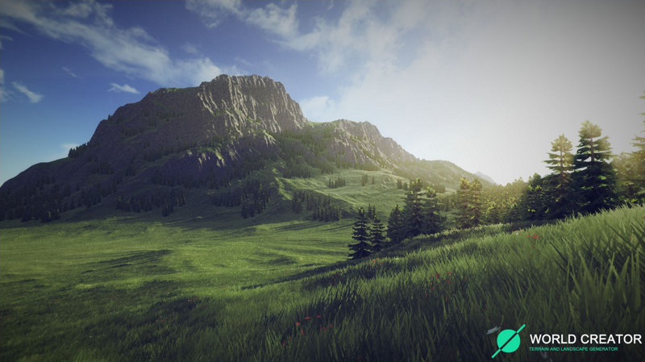
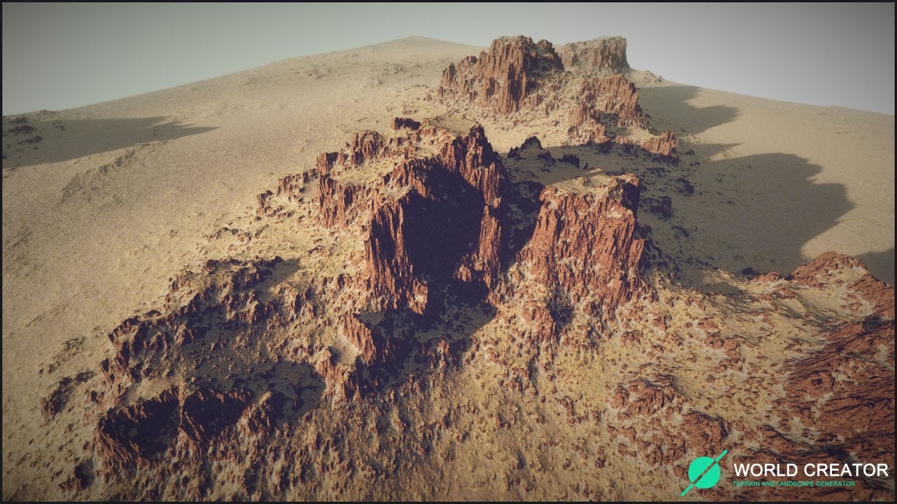

# Ferramenta

O [World Creator 2](https://www.world-creator.com/) é um gerador em tempo real de terrenos e paisagens de propósito geral, sendo possível criar mundos exportáveis para ser utilizado em **jogos**.

Com ele conseguimos fazer mundos para nossos jogos de maneira profissional e rápida.

<h1 align="center">
  
</h1>

<h1 align="center">
  
</h1>

## Conhecendo a Interface

Vamos demonstrar alguns comandos básicos da interface do WC2:

* Menu da Esquerda

Neste menu podemos ter acesso a visualização do mapa de forma facilitada.

1. Criar um Novo Projeto;
2. Carregar Projeto;
3. Salvar Projeto;
4. Salvar Projeto em um lugar específico;
5. Ferramento do SYNC-Tool;
6. Mostrar Mapa de Altura;
7. Mostrar Informações no canto superior direito;
8. Mostrar Manequim;
9. Mostrar Compasso;
10. Mostrar Wireframe;
11. Mostrar Filtros;
12. Mostrar Texturas;
13. Mostrar Objetos;
14. Mostrar Detalhes;
15. Mostrar Tirar uma Foto do Mundo.

* Mapa Inicial

O mapa inicial do WC2 vem com o padrão 2048x2048 com uma seed de heightmap.

* Menu da Direita

O menu da direita é onde vai estar tudo o que iremos fazer no mapa, como configurações de renderização do mundo, adicionar filtros, texturas, áreas e adicionar geração procedural de objetos e simulação de mundo.

## Base

* Base

Na tela inicial do menu da direita, teremos o controle de forma geral de nosso landscape, assim conseguindo trabalhar em todos os aspectos gerais do mapa.

### Gerador

- O Seed irá variar o nosso heightmap inicial;
- O World Creator possui um sistema de **áreas**, que nos permite em separar os lugares do mapa, iremos falar mais sobre ele em uma seção futura.

### Tamanho do Mundo

- Irá travar o tamanho para que a altura e a largura do mundo sejam iguais;
- Define a largura do mundo;
- Define a altura do mundo.

### Precisão

- Por padrão o WC2 vem com 1 metro de precisão, ou seja, a distância entre um **bloco** e outro será de 1 metro.

### Customização da geração do mundo

- Ativando esta opção, podemos alterar manualmente os níveis de altura base de nosso mundo;
- Clicando na opção **Flatten Entire Terrain** podemos deixar o nosso mundo no nível de mar(0).

### Nível de Altura

Aqui é a onde iremos definir a difusão do que estamos acrescentando, sendo divididos por **níveis**(Iremos explicar especificamente sobre esses níveis na seção de Heightmap).

## Opções

* Opções

### Propriedades da Aplicação

- Salvar Automaticamente determinando um período de tempo.

### Configurações do Gerador

- Habilitar geração em tempo real;
- Habilitar geração usando multiframe;
- Distância de Tesselação, recomendável usar uma distância grande quando modelando montanhas ou estruturas complexas(para conseguir avaliar os detalhes).

### Foto

- Tirar foto do projeto.

### Graficos

Nesta aba é a onde teremos as configurações da ferramente para podermos visualizar o nosso mapa de diferentes perspectivas, como sombras, reflexo, DoF, etc...

### Câmera

Aqui podemos configurar a nossa câmera de navegação para as nossas preferências.

### Interface

- Colocar configurações de coloração de nossa ferramenta.

[Próxima Seção](./2-Superficie.md)