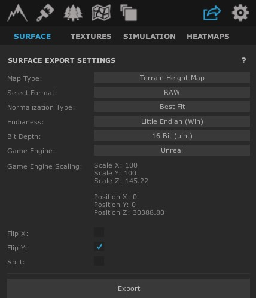
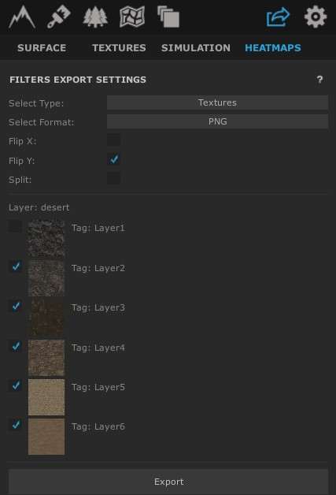
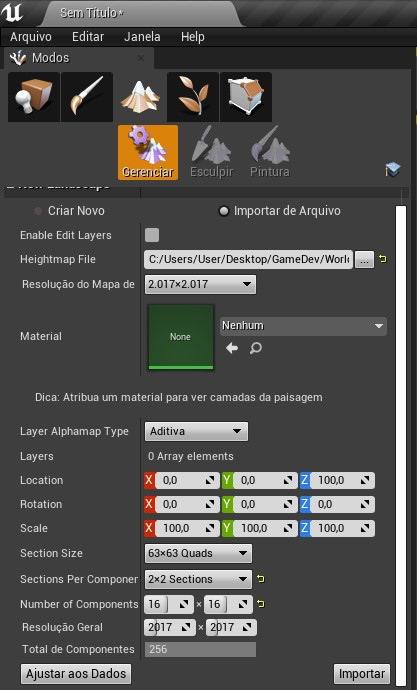
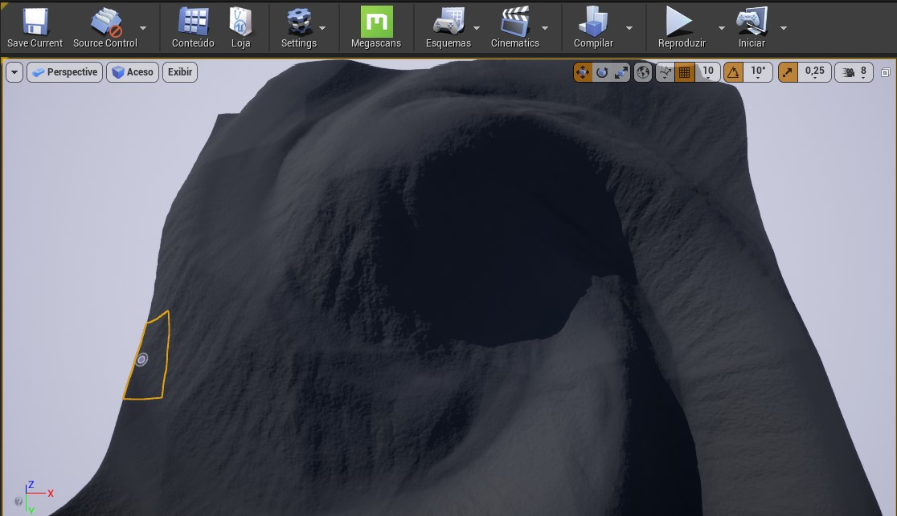
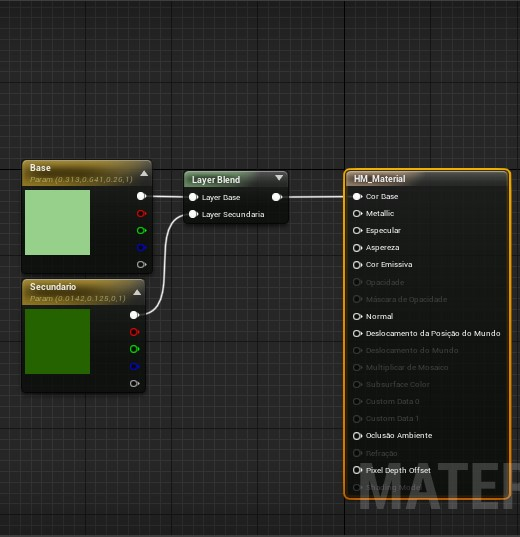
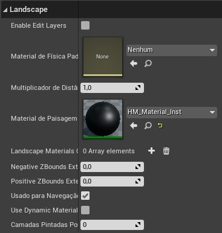

# Exportando para Unreal Engine 4

## Exportando o Heighmap

Na aba de Export > Heightmap, iremos colocar as seguintes configurações.

<h1 align="center">
  
</h1>

Clicando em exportar, recomendamos a utilização desta nomenclatura:

`HM_Desert_4096x4096_z145.22_1m`

HM: Heightmap

Desert: O nome dado para o mapa

4096x4096: Area total do mapa

z145.22: Altura máxima do mapa

1m: Precisão do mapa

## Exportando o Heatmap

<h1 align="center">
  
</h1>

* Não há necessidade de exportar a primeira camada

* Utilize a mesma configuração de flip colocada no heightmap

## Importando na UE4

Para adicionar, clicamos em **Landscape** e importando o arquivo:

<h1 align="center">
  
</h1>

Após importar, você já ira ter o mapa no editor:

<h1 align="center">
  
</h1>

## Criando Textura

Agora, precisamos criar uma "textura mista" para os nossos heatmap's.

Iremos considerar um mapa exportando como duas texturas:

<h1 align="center">
  
</h1>

* Na base, iremos utilizar **sem mistura de peso**, em quanto as texturas seguintes iremos importar o **heatmap**

* Para utilizar texturas externas, utilize o mesmo **blend** para importar normal, bump etc...

* Use a instância do material no landscape:
  
<h1 align="center">
  
</h1>

* Assim, o mapa exportado ficou desta forma:

<h1 align="center">
  
</h1>

* Leia as instruções de landscape da UE4, assim conseguindo tirar um maior proveito das dimensôes utilizadas.