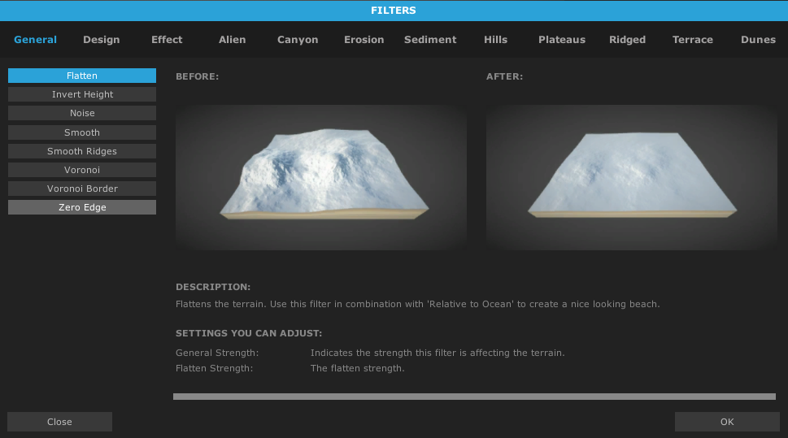
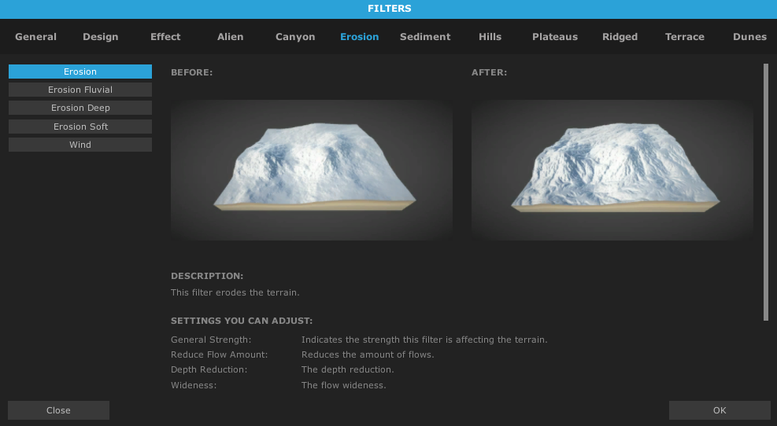
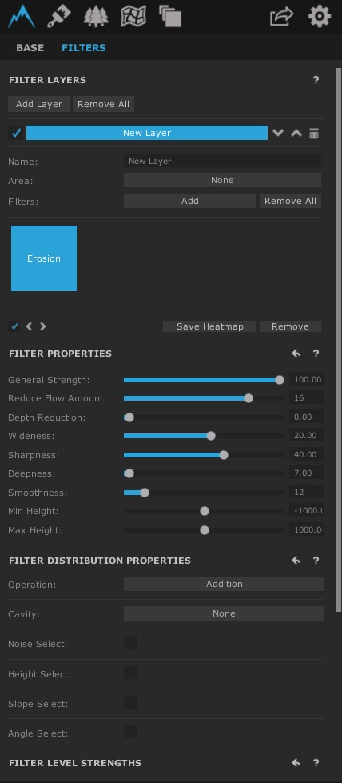

# Filtros

O WC2 possui um sistema de **filtros**, que nos possibilita aplicá-los em nosso mapa, **modelando** da forma que preferirmos.

O WC2 vem com uma coleção de filtros:

<h1 align="center">
  
</h1>

* Mapa

* Dependendo da versão que estiver usando do WC2 irá ter mais filtros ou menos.

* Mesclando filtros diferentes podemos ter efeitos diferentes do que o esperado, e isso não é algo ruim.

* Usando níveis de filtro, podemos moldar de forma detalhada ou geral nosso mundo(explicaremos de forma abrangente na seção de Heightmap).

* Posições de filtros contam, ou seja, os filtros podem se sobrepor dependendo da forma que foi inserido na Layer.

* Layers(camadas) é uma forma de dividir o que formos adicionar, assim mantendo uma organização.

Primeiramente, vamos criar uma **Layer** clicando em **Add Layer**, apos isso clicamos em **Filters: Add**, agora vamos adicionar o filtro **Erosion** que está na própria seção de **Erosion**

<h1 align="center">
  
</h1>

## Propriedade dos Filtros

Podemos observar o seguinte:

<h1 align="center">
  
</h1>

Podemos mecher no seguinte:

- Força do Filtro
- Tamanho em relação ao altura total
- Suavização
- Detalhamento
- Profundamento

* Altura mínima e máxima dependendo do filtro vem com valores padrões na altura que é esperado de se utilizar o filtro, certifique-se de alterar se for preciso.

* Filtros podem possuir opções específicas, sendo os filtros mostrados não possuem uma regra geral.

* Leia as descrições dos filtros para melhor aproveitamento da ferramenta.

* Podemos usar os filtros de formas específicas usando as **áreas**, e iremos explicar como fazer isso.

## Distribuição dos Filtros

- Operações básicas.
- Cavidade(será melhor explicado na seção de texturas).
- Noise é utilizado para a difusão entre os filtros, assim trazendo um efeito mais natural(isso não é uma regra).
- Altura aonde o filtro fará efeito.
- Relação entre o mínimo e o máximo do impacto total do filtro ou textura, depende de sua aplicação.
- Ângulo aonde o filtro irá fazer efeito.

[Próxima Seção](./4-Texturas.md)