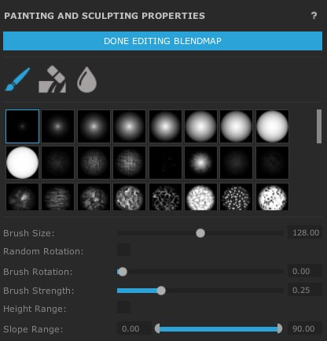
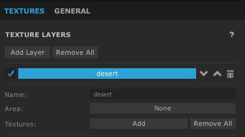
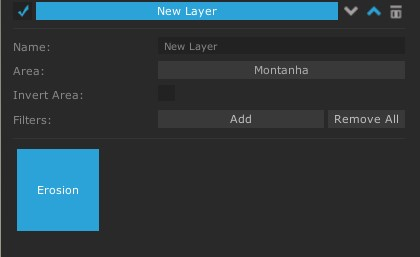

# Areas

**Áreas** é uma forma que o WC2 usa para conseguirmos trabalhar com filtros e texturas de uma forma separada e específica.

Para adicionar uma área é de uma forma parecido como adicionamos filtros:

<h1 align="center">
  
</h1>

- Name: O Nome da Área que será referenciado quando quisermos escolher a área de filtros / texturas.
- Width e Lenght: Altura e Largura da Área.
- Fit to Terrain Size: Considera a altura e largura total do mapa.
- Resolução: Resolução padrão da área, normalmente não precisa usar isso.
- Overlay Image: Imagem para representação da área.
- Has Heightmap: Dessa forma a nossa área irá ter um heightmap próprio.
- Blendmap: Opções diretamente ligadas a área.
- Show Blendmap: Exibir apenas as bordas da área.
- Border Blend Range: Tamanho da Borda Total.

# Edit Blendmap

Aqui podemos esculpir nosso mapa diretamente em uma área, dessa forma não causamos mutação na base do mapa.

<h1 align="center">
  
</h1>

* Usando Áreas conseguimos "dividir" os filtros de texturas sem que afetem diretamente o mapa

* Dessa forma conseguimos dividir ações no mapa como "Rochoso" e "Montanhas", sem afetar outras áreas.

Para adicionar um filtro/textura a uma área, apenas escolhemos a opção **Área**

<h1 align="center">
  
</h1>

Vamos adicionar o filtro **Erosion** em uma área chamada **Montanha**

<h1 align="center">
  
</h1>

[Próxima Seção](./6-Heightmap.md)