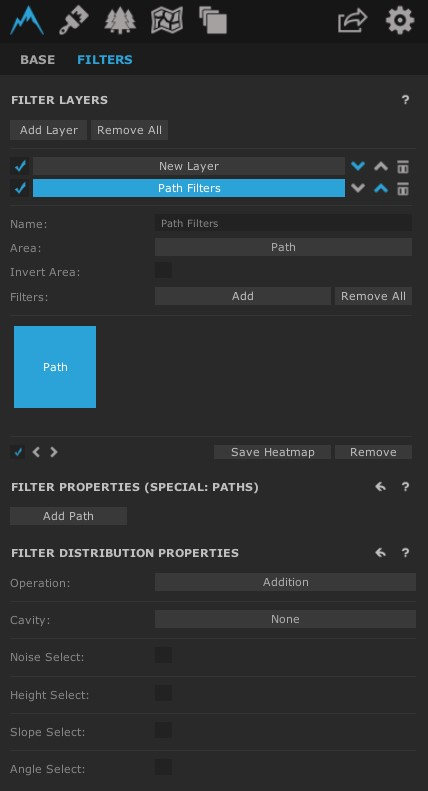
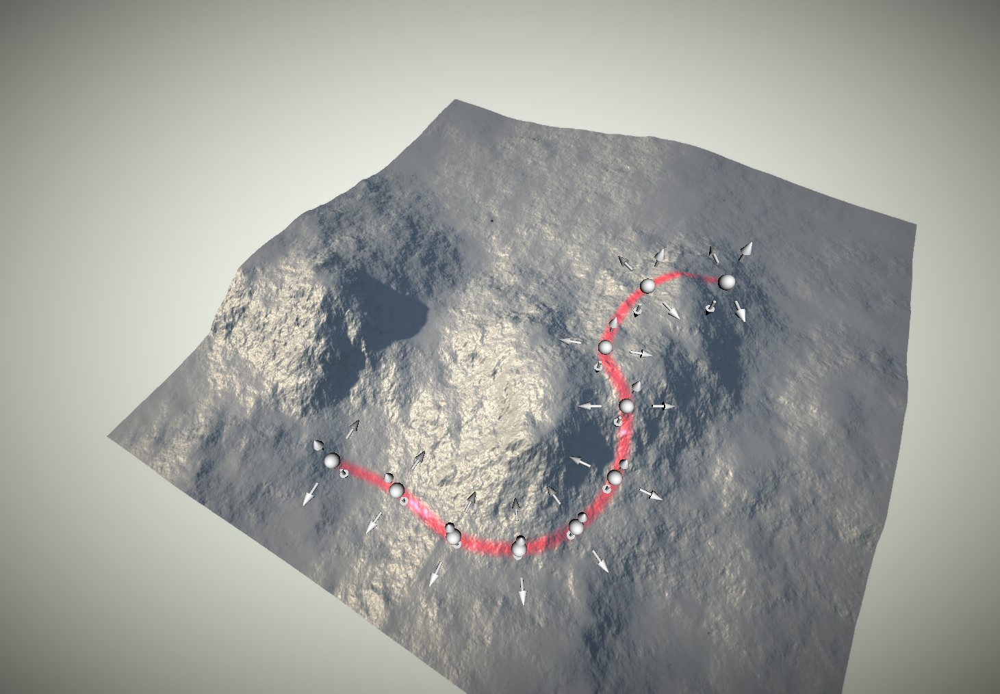

# Estradas

Para modelar estradas ou estruturas específicas, usamos os filtros de **Design**, no caso iremos usar o **Path**

<h1 align="center">
  
</h1>

Clicando em **Add Path** e clicando em **Edit Path**, podemos já utilizá-lo em nosso mapa.

- Adicionar: Shift Esquerdo + Clique Esquerdo
- Adicionar Entre: Ctrc Esquerdo + Click na bolinha
- Remover: Shift Esquerdo + Ctrc Esquerdo + Clique Esquerdo

Usando esses comandos, conseguimos "delimitar" uma área de forma modelada:

<h1 align="center">
  
</h1>

## Opções do Filtro

Temos opções de altura, força e largura(considerando apenas o path). O **Noise Factor** irá "randomizar" de forma procedural o path em questão, normalmente usado para criação de montanhas.

* O Level Step pode ser modificado dependendo da necessidade de respeitar a altura total do Path.

* Modificando as "bolinhas" de forma individual irão afetar as suas distâncias entre as "bolinhas" laterais.

[Próxima Seção](./8-Montanhas.md)