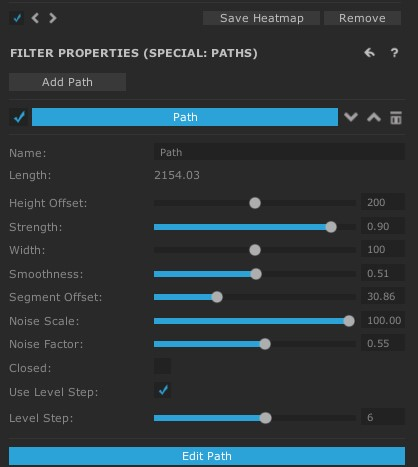

# Montanhas

De uma forma parecida que fizemos a estrada, também iremos utilizar o **Path** para a criação de montanhas.

Utilizando estas configurações:

<h1 align="center">
  
</h1>

Desta forma, conseguimos modelar uma proposta de montanha para conseguir utilizar os nossos filtros.

* É recomendável diminuar ao nivel inicial a primeira e última "bolinha".

* Não utilize filtros de erosão junto com **Path**(no caso, em uma mesma área).

* Aplique inicialmente filtros de efeito no mapa e depois modele as montanhas / estradas ou coisas do gênero.

* Especifique o tamanho mínimo das montanhas para conseguir texturas as pedras de uma forma facilitada futuramente.

* Utilize texturas com cavidade **Convex** para colocar nas "paredes" da montanha.

[Próxima Seção](./9-Unity.md)